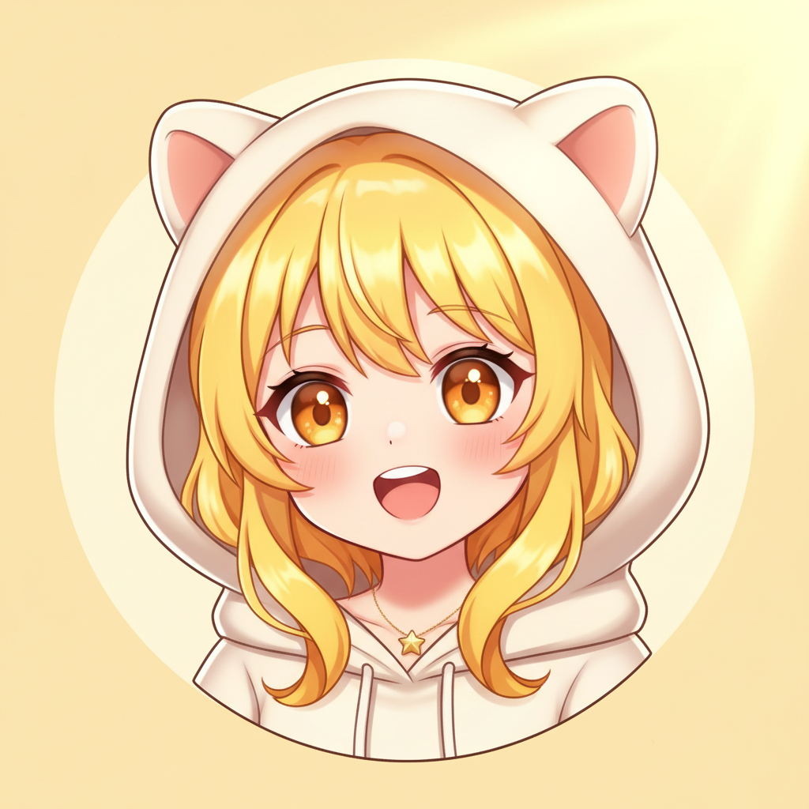

# nanatau

Repository for the VTuber "nanatau" character design, asset management, and blog.

<p align="center">
  
</p>

## Character Prompt

> Quiet bravery in vulnerability.

```text
Soft pale yellow hair, warm golden amber eyes with layered highlights,
pastel yellow and white magical girl outfit, delicate frame.
Expression is introverted, fragile, and trying-her-best:
teary, sleepy, embarrassed, but gentle.
Clean thin-to-medium lineart, flat cel shading, minimal warm background.
Palette is strictly Pale Butter Yellow (#FFFDE7),
Soft Navy (#2C3E6B), Warm White (#FFF8E1).
```

## Directory

- `images/`: approved source assets
- `research/`: research notes and screenshots
- `blog/`: Lume-based blog
- `.claude/skills/motion-pngtuber-nanatau/`: MotionPNGTuber skill and scripts

## MotionPNGTuber

動画ベースの MotionPNGTuber パイプラインは `.claude/skills/motion-pngtuber-nanatau/` に集約している。

- 作業中の成果物: `output/motion-pngtuber/<set-name>/`
- 正本: `images/png-tuber/motion/<set-name>/`
- 標準検証: `.claude/skills/motion-pngtuber-nanatau/scripts/verify_server.py --mode stub`

## Blog

```bash
cd blog
deno task serve
```
