<h1 align="center">
  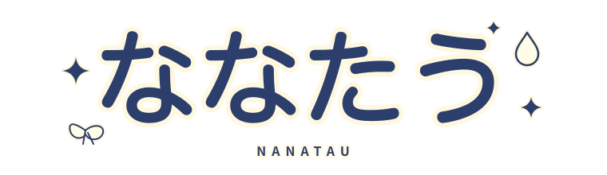
</h1>

<p align="center">
  <strong>涙を魔力に変える、ちょっぴり泣き虫な魔法少女。</strong>
  <br>
  キャラクターデザイン・3Dモデル・動く素材を集めた、ななたうの制作ノート。
</p>

<p align="center">
  <a href="https://nanatau.com/">キャラクターサイト</a> ·
  <a href="#avatar">3Dのななたう</a> ·
  <a href="#materials">モデルと素材</a> ·
  <a href="#development">手元で動かす</a>
</p>

<p align="center">
  <a href="https://nanatau.com/">
    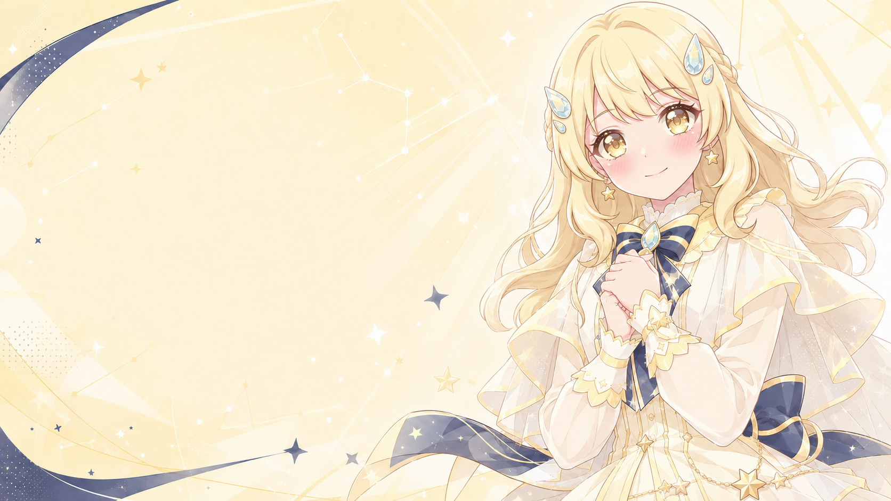
  </a>
</p>

<p align="center">
  <a href="models/avatar-v1/charakuru/videos/dance-tetris-expressions.mp4">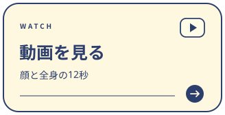</a>
  <a href="#materials">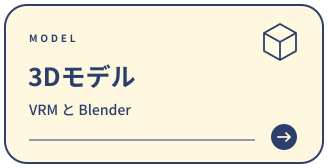</a>
  <a href="images/concept/showcase/">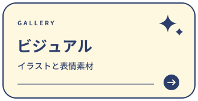</a>
</p>

<br>

<h2 id="about">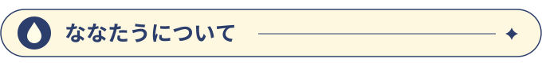</h2>

泣きそうでも、ちょっとだけ前を向く。ななたうは、涙が魔力の源になる魔法少女です。

- **やわらかな黄色の髪と、金色の瞳。** リボンや花飾り、星をあしらった衣装。
- **控えめな表情。** 眠そうな顔、照れた顔、涙目、小さな笑顔。
- **イラストから、動く姿へ。** キャラクター紹介サイト、3Dモデル、MotionPNGTuberの素材を制作しています。

<br>

<h2 id="avatar">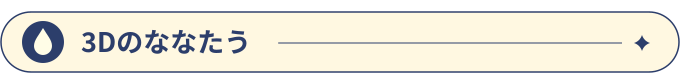</h2>

Charakuruで制作した3Dのななたう。顔立ちはそのままに、まばたきと笑顔がなめらかにつながります。

<p align="center">
  <a href="images/concept/showcase/nanatau-avatar-neutral-1440.webp">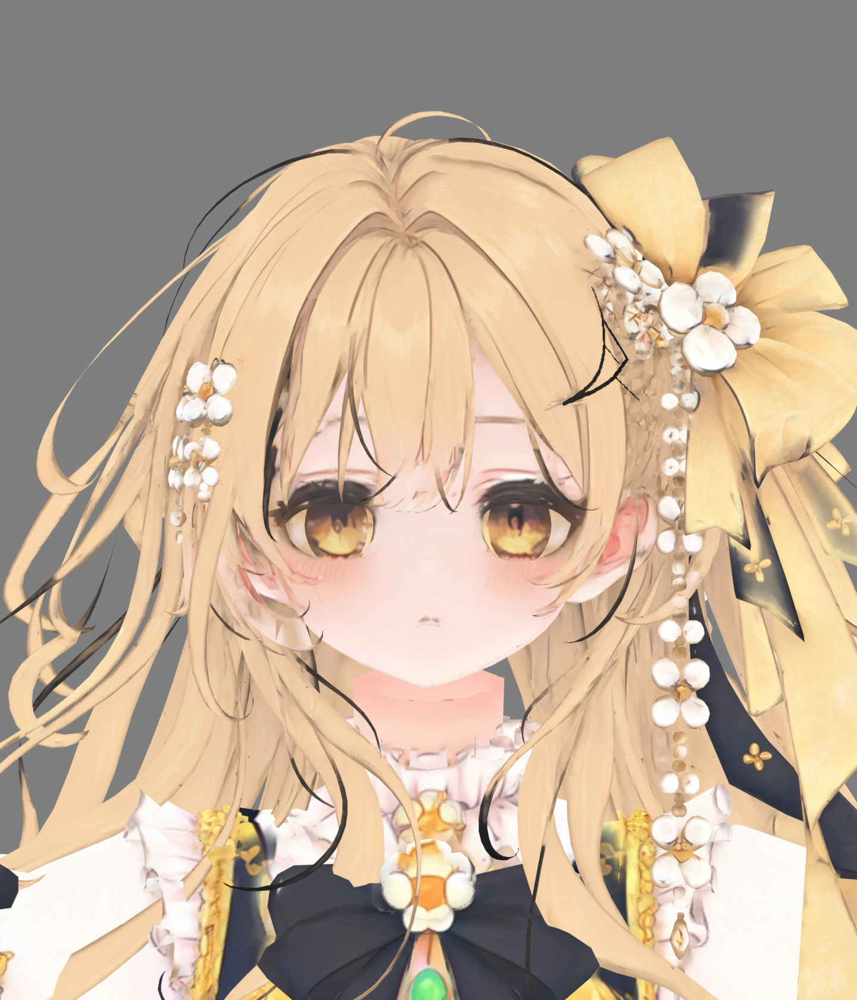</a>
  <a href="images/concept/showcase/nanatau-avatar-blink-1440.webp">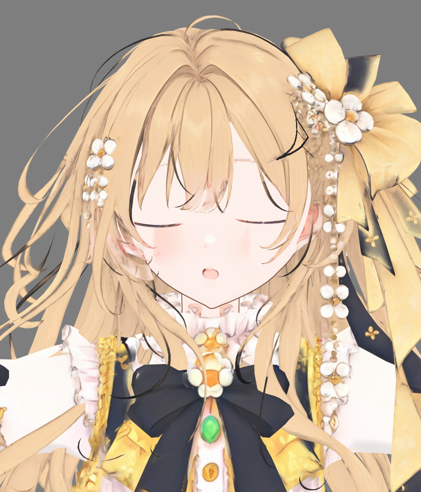</a>
  <a href="images/concept/showcase/nanatau-avatar-happy-1440.webp">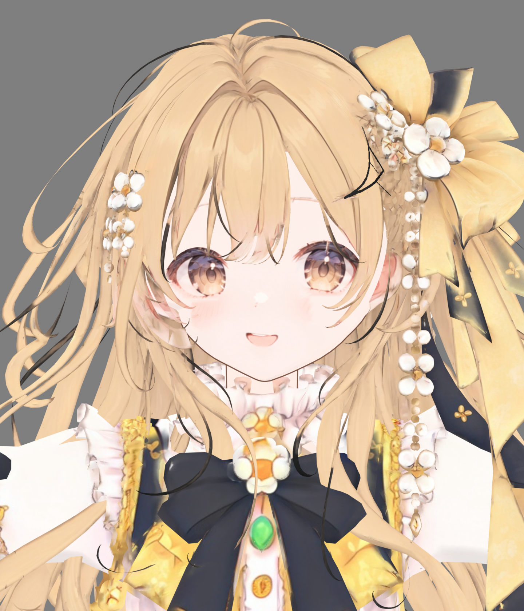</a>
  <br>
  <sub>いつもの顔 · まばたき · ちょっぴりにっこり<br>2026-10-25に正本モデルから撮り直した1440×1680pxの画像です。</sub>
</p>

<p align="center">
  <strong><a href="models/avatar-v1/charakuru/videos/dance-tetris-expressions.mp4">▶ まばたきと笑顔の「テトリス」を見る</a></strong>
  <br>
  <sub>約16秒 · 1080×1350 · 30fps · 音声付き</sub>
</p>

<details>
<summary>モデルの仕様と、確認できていること</summary>

2026-10-24に採用した修正版が現在の正本です。

- VRM 1.0・MToon。髪と衣装の揺れ物設定を含みます。
- まばたきと笑顔は0〜100%で変形し、重ねて使えます。
- 表情の強さ・方向・組み合わせを変えた45通り、Blendの保存・再読み込み、VRMの再書き出しを確認しています。
- テトリス動画は、まばたき4回と笑顔3区間。髪と衣装は、既存の計算済みの揺れを再生しています。

詳しい検証結果と残っている課題は、[3D成果物一覧](models/avatar-v1/charakuru/README.md)を参照してください。

</details>

<details>
<summary>ほかのダンスと、全身の参考画像</summary>

以下は表情追加前のモデルによる記録です。

- [Samba Dancing](models/avatar-v1/charakuru/videos/dance-demo.mp4)：18.2秒、無音。全身と揺れ物の動作確認。
- [愛包ダンスホール](models/avatar-v1/charakuru/videos/dance-short.mp4)：16秒、音声付きの縦動画。
- [6方向・全身・動作確認画像](images/concept/avatar-v1/charakuru/README.md)：現在の3表情と、身体制作時の外観を掲載。

</details>

<br>

<h2 id="materials">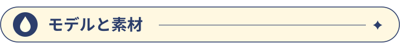</h2>

見たいもの、編集したいものから選んでください。

| 目的 | ファイル・資料 |
| --- | --- |
| 現在の3Dモデルを開く | [avatar.vrm](models/avatar-v1/charakuru/avatar.vrm) |
| Blenderでモデルを編集する | [avatar.blend](models/avatar-v1/charakuru/avatar.blend) |
| イラストや表情素材を見る | [Showcaseのビジュアル](images/concept/showcase/) |
| 配信用の2D素材を見る | [透過PNG](images/png-tuber/transparent/)・[MotionPNGTuber](images/png-tuber/motion/) |
| 制作過程・検証・出典を読む | [Charakuru制作記録](models/avatar-v1/charakuru/PRODUCTION.md) |

3Dモデルは本人のみ使用・再配布不可の設定です。モデル固有の利用条件は[制作記録](models/avatar-v1/charakuru/PRODUCTION.md)とVRMメタデータを確認してください。動画の楽曲・モーションの出典と条件も、同じ制作記録にまとめています。

<br>

<h2 id="development">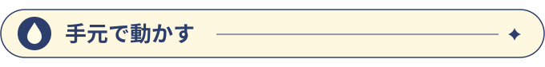</h2>

キャラクター紹介サイトを手元で開くには、Bunを使います。

```bash
cd site
bun install
bun run dev
```

表示されたURL（通常は <http://localhost:5173/>）を開いてください。サイトの構成やデプロイ方法は[サイト開発ガイド](site/README.md)にあります。

<details>
<summary>型チェック・ビルド・秘密情報チェック</summary>

サイトの型チェックと本番ビルド（`site/`で実行）:

```bash
bun run typecheck
bun run build
bun run preview
```

秘密情報チェック（リポジトリ直下で実行）:

```bash
bun install
bun run secretlint
```

</details>

<details>
<summary>ブログを手元で開く</summary>

ブログはLumeとDenoで管理しています。リポジトリ直下から実行してください。

```bash
cd blog
deno task serve
```

本番ビルドは`blog/`で`deno task build`を実行します。

</details>

<details>
<summary>フォルダーと制作のルール</summary>

| 場所 | 内容 |
| --- | --- |
| `images/` | 採用した画像と素材 |
| [models/](models/README.md) | 採用した3Dモデル・動画・検証記録 |
| `output/` | 生成途中のファイルや作業用素材。Git管理外 |
| [site/](site/README.md) | React・TypeScript・Viteのキャラクター紹介サイト |
| [blog/](blog/) | Lumeのブログ |

制作は`output/`で行い、採用した画像だけを`images/`に保存します。MotionPNGTuberの実装と検証手順は[専用スキル](.claude/skills/motion-pngtuber-nanatau/SKILL.md)にまとめています。

配色はPale Butter Yellow（`#FFFDE7`）・Soft Navy（`#2C3E6B`）・Warm White（`#FFF8E1`）。詳しくは[スタイルガイド](.claude/skills/nanatau/STYLE_GUIDE.md)を参照してください。

キャラクター制作の基本プロンプト:

```text
Soft pale yellow hair, warm golden amber eyes with layered highlights,
pastel yellow and white magical girl outfit, delicate frame.
Expression is introverted, fragile, and trying-her-best:
teary, sleepy, embarrassed, but gentle.
Clean thin-to-medium lineart, flat cel shading, minimal warm background.
Palette is strictly Pale Butter Yellow (#FFFDE7),
Soft Navy (#2C3E6B), Warm White (#FFF8E1).
```

</details>

<br>

<h2 id="faq">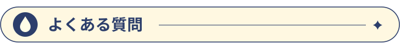</h2>

<details>
<summary>このモデルをそのまま配信に使えますか？</summary>

現時点では、口パクと視線追従（LookAt）は未実装です。現在の修正版はBlenderと書き出した動画で検証していますが、配信アプリや本人トラッキングでの動作は未検証です。確認範囲は[3D成果物一覧](models/avatar-v1/charakuru/README.md)に記載しています。

</details>

<details>
<summary>どのファイルが最新のモデルですか？</summary>

`models/avatar-v1/charakuru/avatar.vrm`と`avatar.blend`が正本です。現在の表情はこの2つに含まれます。`.charakit`とFBXは表情追加前の身体制作の記録です。

</details>

<details>
<summary>動画のモーションや音源も入っていますか？</summary>

リポジトリには撮影済み動画と検証記録を保存しています。元モーション・音源・作業用データはGit管理外の`output/`にあり、cloneには含まれません。出典は[制作記録](models/avatar-v1/charakuru/PRODUCTION.md)を参照してください。

</details>

<details>
<summary>Charakuruの制作プロジェクトが開けません</summary>

`project.charakit`はGit LFSで管理しています。実体を取得していない場合は、リポジトリ直下で`git lfs pull`を実行してください。現在の表情を編集する場合は、`avatar.blend`を使ってください。

</details>

<br>

<p align="center">
  <sub>Quiet bravery in vulnerability.</sub>
  <br>
  <a href="https://nanatau.com/">ななたうのサイトへ</a> ·
  <a href="models/avatar-v1/charakuru/README.md">3Dの制作記録へ</a>
</p>
